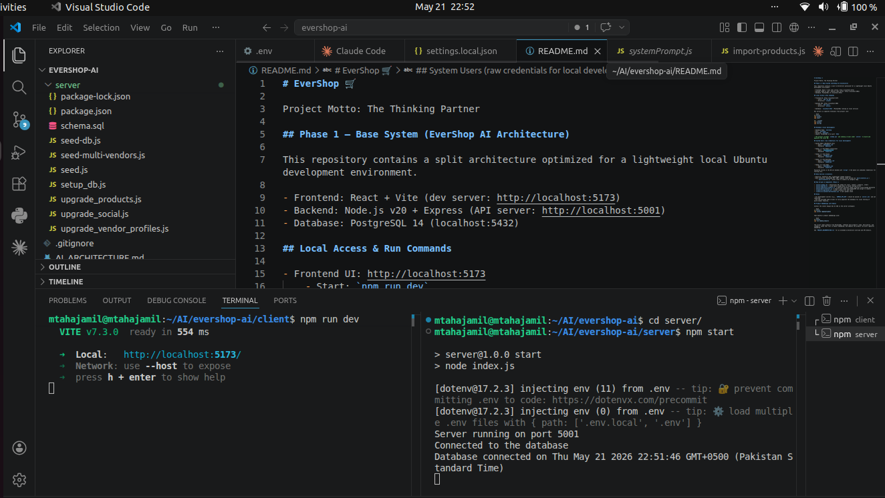
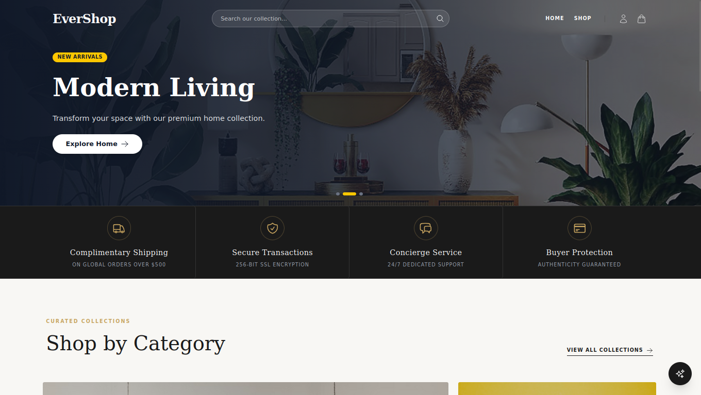
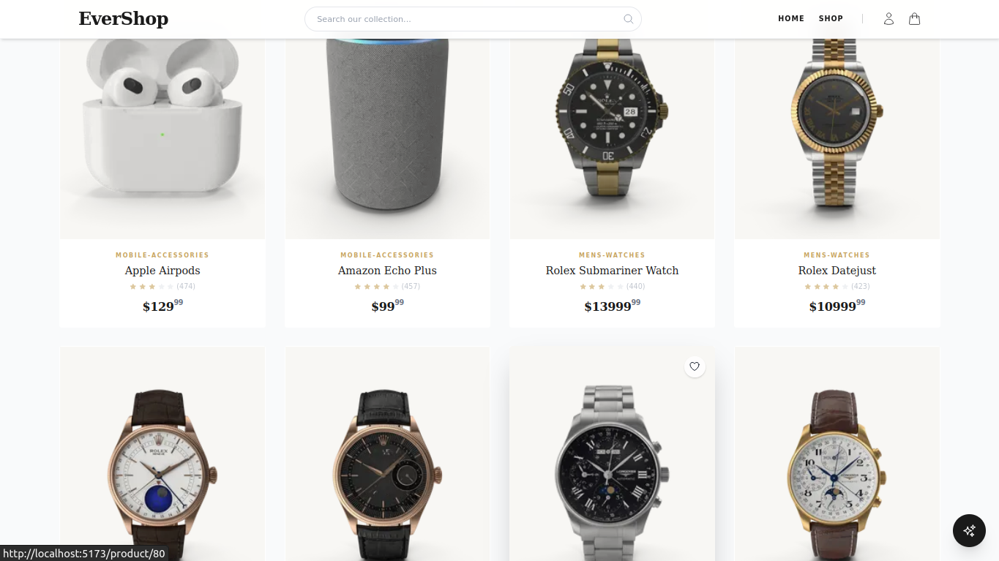
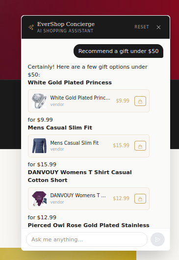
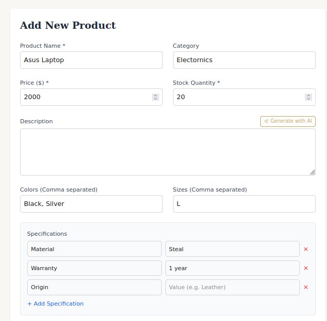
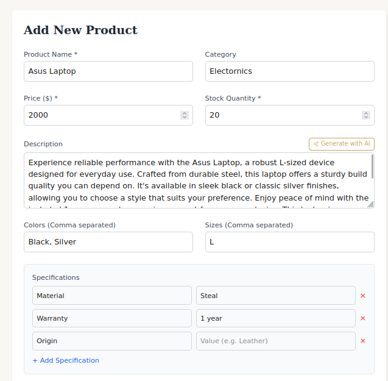
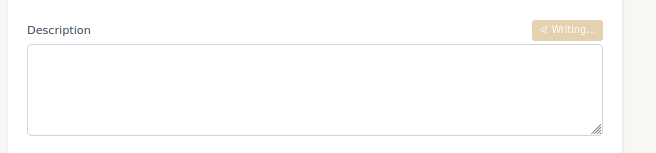
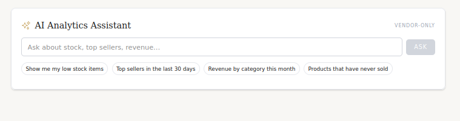
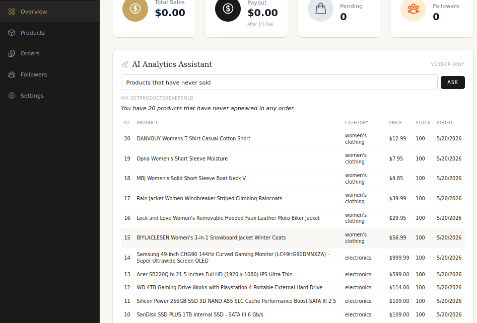

# EverShop 🛒

Project Motto: The Thinking Partner

## Overview

EverShop is a multi-vendor e-commerce system augmented with AI-assisted customer and vendor workflows. This repository provides a split architecture (React client, Node/Express API, PostgreSQL) optimized for reproducible local Ubuntu development and evaluation.

## Phase 1 — Base System (EverShop AI Architecture)

This phase establishes the foundational services, data model, and AI entry points required for storefront browsing, vendor management, and analytics augmentation.

- Frontend: React + Vite (dev server: http://localhost:5173)
- Backend: Node.js v20 + Express (API server: http://localhost:5001)
- Database: PostgreSQL 14 (localhost:5432)

## Local Access & Run Commands

To reproduce the environment, start the API and UI in separate terminals from the project root:

```bash
cd server
npm install
npm start

cd ../client
npm install
npm run dev
```

Service endpoints:
- Frontend UI: http://localhost:5173 (`client/`)
- Backend API: http://localhost:5001 (`server/`)
- Database: PostgreSQL at `localhost:5432`

## Database (Local Development)

- Database Name: `evershop`
- User: `evershop`
- Password: `admin123`
- Engine: PostgreSQL 14 on port `5432`

The project includes `schema.sql` and seeding scripts under `server/` to build and populate the local DB.

## System Users (Local Development Credentials)

- System Admin (Dashboard only)
  - Email: `admin@test.com`
  - Password: `admin123`

- Vendor 1 — The Modern Connoisseur
  - Email: `vendor@test.com`
  - Password: `vendor123`

- Vendor 2 — Tech Haven
  - Email: `tech@test.com`
  - Password: `vendor123`

- Vendor 3 — The Wardrobe
  - Email: `fashion@test.com`
  - Password: `vendor123`

- Vendor 4 — Luxe Gems
  - Email: `jewel@test.com`
  - Password: `vendor123`

Passwords stored in the DB are hashed with `bcrypt` — the above are unhashed credentials for testing only.

## Data Sources & Inventory

- Baseline: FakeStore API (lightweight seeded examples)
- Bulk inventory: DummyJSON API (100+ complex items pulled via `bulk-inventory.js`)
  - `bulk-inventory.js` routes items to vendors by category tags.

## Key Scripts & Components (Phase 1)

- `server/schema.sql` — Relational DB schema for users, vendors, products, orders
- `server/seed-db.js` — Seed exact-schema data to avoid routing errors
- `server/seed-multi-vendors.js` — Generate multiple vendor profiles using hashed passwords
- `server/bulk-inventory.js` — Import bulk items from DummyJSON and assign to vendors
- `client/src/api/axios.js` — Axios instance for API calls
- `client/src/context/CartContext.jsx` — Cart global state

## Security and Secrets

- All development secrets (e.g., `GEMINI_API_KEY`) should be placed in `server/.env` and not committed.
- Use the provided seed scripts to fully populate the database for local testing of multi-vendor features.

## Product Embeddings with Gemini

Install the latest Google Gen AI SDK in the server workspace:

```bash
cd server
npm install @google/genai
```

Then backfill product embeddings with:

```bash
cd server
npm run embed:products
```

The script reads products from PostgreSQL, combines each product's name, description, and category, sends that text to Gemini embedding, and updates the product row with a pgvector embedding.

See `PROJECT_DOCUMENTATION.txt` for an extended architecture overview and API details.

## Visual Documentation (Hierarchical)

### 1. Development Environment

Figure 1. Local development workspace showing concurrent client and server processes.


### 2. Customer-Facing Storefront

Figure 2. Home page hero and primary navigation for the storefront.


Figure 3. Product grid supporting catalog browsing and category context.


Figure 4. AI concierge interface for guided product discovery.


### 3. Vendor Operations

#### 3.1 Product Authoring

Figure 5. Add-product form capturing core attributes and specifications.


Figure 6. AI-generated description populated into the product form.


Figure 7. AI writing state indicating generation in progress.


#### 3.2 Vendor Analytics Assistant

Figure 8. Prompt suggestions that accelerate common analytics queries.


Figure 9. Analytics results table showing vendor-level insights.
